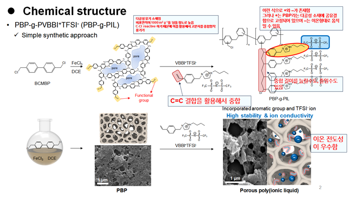

# 실험 시스템 구조 분석 및 MD 개발 전략 전면 수정

이미지를 통해 실험팀의 시스템이 명확해졌습니다. 당신이 처음에 생각했던 "BCMBP 올리고머에 VBBI⁺가 하나씩 치환"되는 단순한 구조가 아니라, **훨씬 복잡하고 정교한 다공성 고분자 네트워크 시스템**입니다.

## **실제 시스템 구조: PBP-g-PVBBI⁺TFSI⁻**

**합성 과정의 정확한 이해:**

**1단계 - PBP (다공성 바이페닐 폴리머) 골격 형성:**
BCMBP 단량체가 FeCl₃ 촉매 하에서 Friedel-Crafts 반응으로 3차원 가교 중합됩니다. 이 과정에서 거대한 **다공성 아로마틱 네트워크**가 형성되며, SEM 이미지에서 보이는 마이크로/메조 다공성 구조가 만들어집니다. 중요한 점은 반응하지 않은 **-CH₂Cl 그룹들이 기공 표면에 그대로 남아있다**는 것입니다.

**2단계 - PVBBI⁺ 고분자 사슬 그라프팅:**
남은 -CH₂Cl 그룹을 개시점으로 하여 VBBI⁺TFSI⁻의 vinyl 그룹이 **surface-initiated polymerization** (grafting-from 방식)으로 중합됩니다. 결과적으로 PBP 기공 벽면에서 **PVBBI⁺ 고분자 사슬들이 브러시처럼 자라나는 구조**가 됩니다.

**"보리굴비 구조"의 실체:**

- **덕장 (고정 골격)**: PBP 다공성 네트워크
- **굴비 줄 (고분자 사슬)**: 기공 벽면에서 자라난 PVBBI⁺ 사슬들
- **굴비 (고정된 양이온)**: 사슬에 공유결합으로 묶인 VBBI⁺ 이미다졸리움
- **바람 (이동하는 음이온)**: 자유롭게 호핑할 수 있는 TFSI⁻

## **핵심 메커니즘 가설의 재정의**

**Single-Ion Conductor 메커니즘:**
이 시스템은 **양이온이 고분자 사슬에 고정된 single-ion conductor**입니다. 이온 전도는 오직 **TFSI⁻ 음이온의 이동**에 의해서만 발생하며, 이는 일반적인 이온성 액체와 근본적으로 다른 메커니즘입니다.

**π-π Stacking Column 가설 (검증 필요):**
이미지 우측 상단의 주황색 타원 구조가 시사하는 바는, 기공 내에서 **VBBI⁺의 이미다졸리움 링들이 π-π stacking으로 층층이 쌓인 column 구조**를 형성할 가능성입니다. 만약 이것이 실제라면:

- 이미다졸리움 링들이 3.5-4.0 Å 간격으로 정렬된 "이온 전도 고속도로" 형성
- TFSI⁻가 이 column 표면을 따라 낮은 에너지 장벽으로 호핑 이동
- 무작위 배열 대비 현저히 향상된 이온 전도도 달성

**주의:** 이 π-π stacking column 형성은 현재 **가설 단계**이므로, 부경대 미팅에서 실험적 증거 유무를 반드시 확인해야 합니다.

## **MD 개발 전략의 근본적 수정**

**기존 계획의 문제점:**

- 단순한 올리고머 모델로는 실제 시스템의 복잡성 재현 불가
- 다공성 구조와 고분자 브러시 효과 무시
- Grafting density와 chain length 효과 미반영

**수정된 모델링 전략:**

**Phase 1: 최소 단위 검증 (3주)**
전체 다공성 구조를 한 번에 모델링하는 것은 불가능하므로, **"PBP 표면 슬랩 + PVBBI⁺ 브러시"** 형태의 최소 모델을 구성합니다:

- PBP 표면을 평면 또는 원통형 기공으로 단순화
- 표면에서 자라난 3-5개의 PVBBI⁺ 사슬 (각 사슬당 DP=5-15)
- 적절한 수의 TFSI⁻ 음이온 배치
- AIMD로 π-π stacking 자발 형성 여부 확인

**Phase 2: 메커니즘 특화 MACE 개발 (5주)**
일반적인 configuration space가 아닌 **호핑 메커니즘에 특화된 DFT 데이터셋** 구축:

- NEB로 TFSI⁻의 이미다졸리움 간 호핑 경로 계산
- π-π stacked vs non-stacked 배열에서의 에너지 장벽 비교
- 다양한 stacking arrangement (parallel, T-shaped, offset) 포함
- MACE-OFF-μ 활용으로 분극 효과 명시적 모델링

**Phase 3: 대조군 비교 시뮬레이션 (6주)**
메커니즘 증명을 위한 체계적 비교:

- **Target**: 완전한 PBP-g-PVBBI⁺TFSI⁻ 구조
- **Control A**: 물리적 혼합 (PBP + 자유 VBBI⁺TFSI⁻)
- **Control B**: 낮은 그라프팅 밀도 (30-50% 치환)
- **Control C**: 다른 음이온 (BF₄⁻, PF₆⁻) 사용

각 시스템에서 호핑 빈도, 확산 계수, 활성화 에너지를 비교하여 메커니즘을 정량적으로 증명합니다.

## **부경대 미팅 핵심 질문 리스트**

이미지 분석을 바탕으로 다음 사항들을 반드시 확인하세요:

**구조 관련 (최우선):**

1. **"PBP의 평균 기공 직경이 몇 nm인가요? BET 표면적은?"** (시뮬레이션 박스 크기 결정)
2. **"PVBBI⁺ 사슬 하나당 단량체가 평균 몇 개 연결되나요?"** (중합도 확인)
3. **"그라프팅 효율이 몇 %인가요? NMR로 정량화된 데이터가 있나요?"**
4. **"최종 생성물에서 자유 VBBI⁺TFSI⁻가 추가로 들어있나요?"**

**π-π Stacking 가설 검증:** 5. **"이미지의 주황색 타원 구조(적층 구조)가 실제 관찰되었나요?"** 6. **"SAXS/WAXS에서 3.5-4 Å 피크가 보이나요?"** (aromatic stacking 특징) 7. **"UV-Vis나 형광 스펙트럼에서 π-π interaction 증거가 있나요?"**

**이온 전도 메커니즘:** 8. **"온도별 이온 전도도의 Arrhenius 활성화 에너지는?"** 9. **"순수 VBBI⁺TFSI⁻ IL과 비교한 전도도 향상 정도는?"** 10. **"다른 음이온(BF₄⁻ 등)으로 실험한 데이터가 있나요?"**

## **예상 시뮬레이션 결과 및 논문 전략**

**성공 시나리오:**

1. **구조**: 기공 내에서 PVBBI⁺ 사슬들이 π-π stacking column을 자발적으로 형성
2. **동역학**: TFSI⁻가 column을 따라 preferential hopping pathway 생성
3. **에너지**: Stacked configuration에서 hopping barrier < non-stacked configuration
4. **전도도**: Target system > Control systems의 명확한 차이

**핵심 분석 도구:**

- **Van Hove correlation function**: Discrete hopping의 직접적 증거
- **Anisotropic diffusion**: Column 방향 vs 수직 방향 이동성 비교
- **Residence time distribution**: 각 이미다졸리움 site에서의 체류 시간

**논문 스토리:**
"Grafted imidazolium cations self-assemble into ordered π-π stacking columns within porous polymer networks, creating low-barrier pathways for anion hopping and resulting in enhanced ionic conductivity compared to physically mixed systems."

## **실험 검증 제안**

시뮬레이션 결과를 바탕으로 실험팀에 제안할 수 있는 검증 실험:

- **SAXS에서 q ≈ 1.6-1.8 Å⁻¹ 피크 확인** (π-π stacking 증거)
- **Variable temperature ¹⁹F NMR**로 TFSI⁻ dynamics 측정
- **그라프팅 밀도 변화 샘플**에서 전도도 percolation threshold 관찰

이제 실험 시스템의 복잡성을 제대로 이해했으므로, 단순한 올리고머 시뮬레이션이 아닌 **다공성 네트워크 내 고분자 브러시 시스템**에 맞는 전문적인 MD 개발이 필요합니다. 부경대 미팅에서 위의 질문들로 세부사항을 확인한 후, 즉시 수정된 전략으로 시뮬레이션을 시작할 수 있을 것입니다.
