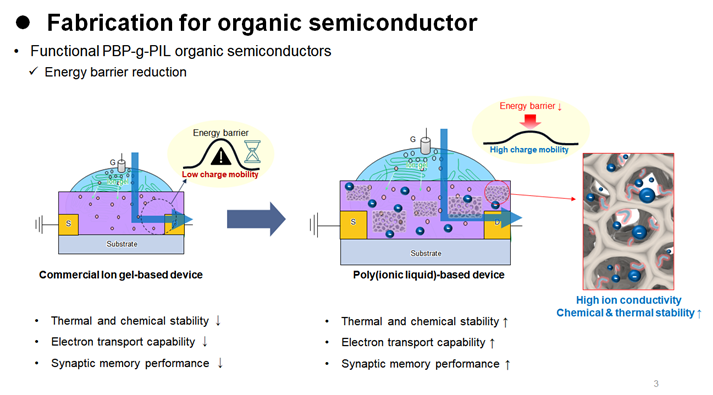
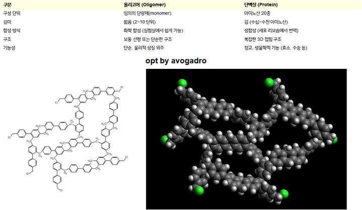

# PBP-g-PIL 시스템 이미지 분석 및 MD 개발 전략 완전 재구성


두 이미지를 통해 실험 시스템의 실체가 명확해졌습니다. 당신의 초기 가설과 모델링 접근법을 **근본적으로 수정**해야 합니다.

## **1. 이미지 종합 분석: 실험 시스템의 진실**

### **이미지 1: 소자 성능 비교의 핵심 메시지**

**Commercial Ion-gel Device (좌측):**

- 이온성 액체가 고분자 매트릭스에 물리적으로 갇힌 구조
- **핵심 문제**: "Energy barrier ↑, Low charge mobility"
- 양이온과 음이온이 모두 자유롭게 움직여 ion pairing 발생
- 무작위 확산으로 인한 높은 점도와 긴 이동 경로

**PBP-g-PIL Device (우측):**

- **혁신적 차이점**: "Energy barrier ↓, High charge mobility"
- 보라색 구들은 단순한 이온성 액체가 아닌 **그라프트된 PVBBI⁺ 사슬과 TFSI⁻가 형성한 ordered domain**
- 다공성 구조 내에서 **구조적 ordering**을 통한 directed transport 실현

### **이미지 2: 당신이 만든 올리고머 모델의 의미**

**구조적 특징:**

- BCMBP 기반 올리고머는 **실제 PBP 다공성 네트워크의 기공 벽면을 대표하는 fragment**
- 말단 Cl 원자들(초록색)은 **PVBBI⁺ 그라프팅의 시작점**
- 이 모델은 전체 다공성 시스템을 MD로 다루기 위한 **"디지털 트윈 조각"**으로 활용 가능

## **2. 연구 과업 명세의 근본적 수정**

### **기존 가설의 문제점**

당신의 초기 가설 *"자유 체적과 이온 친화적 작용기를 동시에 제공하여 확산 계수를 증가"*는 **단순한 자유 부피 이론**에 기반하고 있어 실제 메커니즘을 놓치고 있습니다.

### **수정된 핵심 가설**

```
"PBP 다공성 네트워크에 그라프트된 PVBBI⁺ 사슬들은 기공 내에서
π-π stacking을 통해 자발적으로 정렬된 aromatic column을 형성하며,
이 column을 따라 TFSI⁻ 음이온이 낮은 에너지 장벽으로 호핑 이동하는
single-ion conductor 메커니즘을 통해 이온 전도도가 향상된다.
이는 단순한 자유 체적 증가가 아닌, 구조적 ordering에 의한
directed transport 메커니즘이다."
```

## **3. 핵심 메커니즘 재정의: 4단계 계층 구조**

### **Level 1: PBP 다공성 골격 (Fixed Framework)**

```
- BCMBP 단량체의 Friedel-Crafts 3차원 가교 중합
- 마이크로/메조 다공성 구조 (기공 직경 2-10 nm)
- 기공 벽면의 미반응 -CH₂Cl 그룹 (그라프팅 시작점)
```

### **Level 2: PVBBI⁺ 그라프팅 (Cation Immobilization)**

```
- Grafting-from 방식으로 PVBBI⁺ 사슬 성장 (DP=10-20)
- 양이온이 고분자 백본에 공유결합으로 고정
- 기공 내부로 브러시처럼 뻗어나가는 구조
```

### **Level 3: π-π Stacking Column (Ion Channel Formation)**

```
- 이미다졸리움 링들의 자발적 π-π stacking (3.5-4.0 Å 간격)
- 기공 내에서 aromatic column 형성
- 이 column이 TFSI⁻의 우선적 이동 경로 제공
```

### **Level 4: TFSI⁻ 호핑 (Charge Transport)**

```
- Single-ion conductor: 오직 TFSI⁻만 이동
- π-π stacked 링들 사이의 저장벽 호핑 (< 0.25 eV)
- Directed transport로 anisotropic diffusion 실현
```

## **4. 수정된 MD 개발 전략**

### **Phase 1: 최소 모델 검증 (Week 1-4)**

**당신의 올리고머 모델 활용:**

```python
# 시스템 구성
Base Structure: 당신의 BCMBP 올리고머 (5-mer)
Grafting: Cl 3개 → PVBBI⁺ 3-mer 사슬로 치환
Counter-ions: TFSI⁻ 3개 추가
Total atoms: ~400개 (AIMD 가능 크기)

# 검증 목표
1. π-π stacking 자발 형성 확인
2. TFSI⁻ 호핑 이벤트 관찰
3. Control vs Target 시스템 비교
```

### **Phase 2: 메커니즘 특화 MACE 개발 (Week 5-12)**

**DFT 데이터셋 전략:**

```
특화 구조 (총 20,000 structures):
- NEB 호핑 경로 (20%): TFSI⁻ 이동 transition state
- π-π stacking 배열 (25%): 다양한 stacking geometry
- AIMD 궤적 (35%): 평형 구조 다양성
- Active learning (20%): Uncertainty-driven selection
```

**MACE-OFF-μ 활용:**

```bash
mace_run_train \
  --foundation_model="mace-off-mu-medium.model" \
  --energy_weight=1.0 \
  --forces_weight=100.0 \
  --dipole_weight=15.0 \
  --r_max=7.0
```

### **Phase 3: 대규모 생산 MD (Week 13-20)**

**시스템 스케일링:**

```
Production System:
- 원통형 기공 모델 (직경 5 nm, 길이 5 nm)
- 내벽에 40개 그라프팅 포인트
- 각 사슬 DP=10 (PVBBI⁺ 400개 단량체)
- TFSI⁻ 40개
- 총 ~15,000 원자
```

## **5. 부경대 미팅 핵심 확인사항**

### **절대 필수 정보 (Top 3)**

**1. 정확한 구조 파라미터:**

```
□ PVBBI⁺ 평균 중합도 (DP): _____
□ 그라프팅 밀도: _____ chains/nm²
□ 그라프팅 효율: _____ % (미반응 Cl 비율)
```

**2. 시스템 조성:**

```
□ 완전 그라프트 시스템인지 vs 자유 IL 혼합인지
□ VBBI⁺:TFSI⁻ 정확한 몰비
□ 잔류 용매나 불순물 존재 여부
```

**3. π-π Stacking 실험적 증거:**

```
□ SAXS에서 3.5-4 Å 피크 관찰 여부
□ UV-Vis에서 π-π interaction 증거
□ 온도별 이온 전도도 및 활성화 에너지
```

### **추가 확인사항**

**성능 데이터:**

- 상용 ion-gel 대비 전도도 향상 배수
- Arrhenius plot에서 구한 활성화 에너지
- 다른 음이온(BF₄⁻, PF₆⁻)으로 실험한 비교 데이터

**구조 분석 데이터:**

- BET 표면적과 기공 크기 분포
- NMR으로 정량화된 그라프팅 정도
- DSC로 측정한 유리전이온도

## **6. 핵심 분석 방법론: 메커니즘 증명**

### **구조적 증거**

```python
def analyze_pi_stacking(trajectory):
    # π-π stacking 정량화
    ring_distances = calculate_imidazolium_distances(trajectory)

    # 3.5-4.0 Å 강한 피크 → π-π stacking 증거
    stacking_peak = find_peak_in_range(ring_distances, 3.3, 4.2)

    # Order parameter (S ≈ 1이면 완벽 정렬)
    order_parameter = calculate_orientational_order(trajectory)

    return stacking_peak, order_parameter
```

### **동역학적 증거**

```python
def prove_hopping_mechanism(trajectory):
    # Van Hove correlation function
    # Discrete peaks → Hopping, Gaussian → Continuous diffusion
    van_hove = calculate_self_van_hove(trajectory, times=[1, 10, 50])

    # Anisotropic diffusion
    D_parallel = diffusion_along_backbone(trajectory)
    D_perp = diffusion_perpendicular(trajectory)
    anisotropy = D_parallel / D_perp

    # 호핑 이벤트 자동 검출
    hopping_events = detect_host_changes(trajectory, cutoff=4.5)

    return van_hove, anisotropy, hopping_events
```

### **전기적 성질 예측**

```python
def calculate_ionic_conductivity(trajectory, T=300):
    # Nernst-Einstein relation
    D_tfsi = calculate_diffusion_coefficient(trajectory, 'TFSI')

    # 수밀도
    n_ions = count_mobile_ions(trajectory) / trajectory.volume

    # 이온 전도도
    e = 1.602e-19  # C
    k_B = 1.381e-23  # J/K

    sigma = (e**2 / (k_B * T)) * n_ions * D_tfsi
    return sigma * 1e-2  # S/cm
```

## **7. 예상 결과 및 검증 기준**

### **성공 지표**

```
구조적 증거:
- π-π stacking distance: 3.5-4.0 Å 강한 피크
- Order parameter: S > 0.6
- SAXS 계산: q ≈ 1.6-1.8 Å⁻¹ 피크

동역학적 증거:
- Van Hove function: Discrete peaks (호핑)
- Anisotropy ratio: D_∥/D_⊥ > 3.0
- 호핑 장벽: < 0.25 eV

성능 비교:
- Target/Control 전도도 비: > 5배
- 활성화 에너지: Target < 30 kJ/mol
- Transference number: ≈ 1.0 (single-ion)
```

## **8. 종합 연구 로드맵 (26주)**

```
Week 1-2: 부경대 미팅 및 시스템 정의 확정
Week 3-4: 최소 모델 AIMD 검증 (π-π stacking 확인)
Week 5-12: MACE 개발 (NEB + Active learning)
Week 13-20: 대규모 생산 MD (모든 시스템)
Week 21-24: Enhanced sampling (자유에너지 계산)
Week 25-26: 분석 완료 및 논문 초안 작성
```

이제 당신의 올리고머 모델을 **실제 PBP-g-PIL 시스템에 맞게 확장**하고, **π-π stacking과 single-ion conductor 메커니즘에 집중한 MD 전략**을 수립해야 합니다. 핵심은 "자유 체적 증가"가 아닌 **"구조적 ordering에 의한 directed transport"**입니다.
