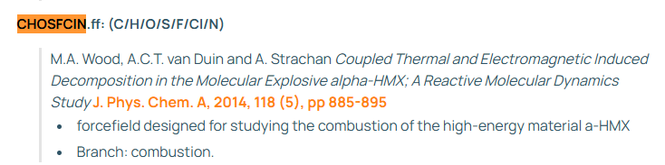
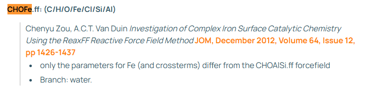

# 대체재로 https://www.scm.com/doc/ReaxFF/Included_Forcefields.html 여기서 찾기

제공된 목록에서 **BCMBP(4,4'-Bis(chloromethyl)-1,1'-biphenyl)**의 **Friedel-Crafts 가교 중합(Cross-linking)**을 모사하기 위해 가장 적합한 후보를 찾아냈습니다.

결론부터 말하면, **`CHOSFClN.ff`** 또는 **`CHOFe.ff`** (촉매 포함 시)가 가장 유력합니다. 그 이유는 다음과 같습니다.

### 1. 반응 필수 원소 및 메커니즘 분석

- **BCMBP 구성 원소:** C, H, Cl (Biphenyl 골격 + Chloromethyl 그룹)
- **반응 메커니즘:** Friedel-Crafts 반응은 **C-Cl 결합이 끊어지고**, **HCl이 제거**되면서, 벤젠 고리 간에 **새로운 C-C 결합(메틸렌 가교)**이 형성되어야 합니다.
- **필요 조건:** 방향족 고리(Aromatics)에 대한 정확한 기술과 C-Cl 결합 해리 에너지가 잘 튜닝되어 있어야 합니다.

### 2. 추천 Force Field (우선순위별)

#### **1순위: `CHOSFClN.ff` (촉매 없이 반응 자체에 집중할 때)**

- **포함 원소:** C, H, O, S, F, **Cl**, N
- **관련 논문:** M.A. Wood et al., _J. Phys. Chem. A_ (2014)
- **추천 이유:**
- **목적 적합성:** 이 FF는 **고에너지 물질(HMX)의 열분해 및 연소**를 연구하기 위해 개발되었습니다. 즉, C-H-N-O-Cl 시스템 내에서 **결합이 끊어지고 새로운 분자가 형성되는 '반응성(Reactivity)'**에 초점을 맞춘 파라미터입니다.
- **화학종:** 유기물 내의 **C-Cl 결합 파괴**와 **HCl 생성**을 다룰 수 있는 파라미터가 포함되어 있습니다.
- **방향족:** 기반이 되는 `CHO.ff`는 탄화수소 연소용이므로 벤젠 고리(Biphenyl)의 안정성을 잘 유지하면서 가교 반응을 시뮬레이션하기에 적합합니다.

#### **2순위: `CHOFe.ff` (FeCl3 같은 금속 촉매를 포함할 때)**

- **포함 원소:** C, H, O, **Fe**, **Cl**, Si, Al
- **관련 논문:** Chenyu Zou et al., _JOM_ (2012)
- **추천 이유:**
- **촉매 반응:** Friedel-Crafts 반응은 보통 루이스 산(, ) 촉매 하에서 일어납니다. 이 FF는 **"Complex Iron Surface Catalytic Chemistry"**를 위해 개발되었으며, 철(Fe)과 유기물, 그리고 염소(Cl) 간의 상호작용이 정의되어 있습니다.
- 만약 시뮬레이션 시스템에 촉매 입자를 명시적으로 넣고 싶다면 이 파일이 유일한 대안입니다.

### 3. 검증 전략 (필독)

Friedel-Crafts 반응은 이온성 중간체(Carbocation)를 거치는 경우가 많습니다. ReaxFF는 기본적으로 비반응성 전하 평형(QEq)을 사용하므로, 이온성 메커니즘의 전이 상태 장벽을 완벽하게 맞추기는 어렵습니다. 따라서 다음 전략을 권장합니다.

1. **`CHOSFClN.ff`**를 사용하여 고온(High Temperature MD)에서 가교가 일어나는지 먼저 테스트하십시오.
2. 가교가 잘 일어나지 않는다면, 반응 장벽을 넘기 위해 `Bond Boost` 기법이나 `Temperature Accelerated Dynamics`를 병행해야 할 수 있습니다.

**결론:** 제공된 목록 중에서는 **`CHOSFClN.ff`**가 BCMBP의 유기 가교 반응을 시뮬레이션하기에 가장 적합한 베이스라인입니다.

---

# 이건 어떤지 조사 해봄 https://github.com/paolodeangelis/Enhancing_ReaxFF_DFT_database

결론부터 말씀드리면, **BCMBP의 가교 반응(Friedel-Crafts reaction) 시뮬레이션에는 직접적으로 사용할 수 없습니다.**

사용하시려는 목적(유기 가교 반응)과 이 저장소의 목적이 완전히 다르기 때문입니다. 구체적인 이유는 다음과 같습니다.

### 1. 원소가 다릅니다 (가장 큰 이유)

- **사용자님의 필요 원소:** **C, H, Cl** (BCMBP는 유기물이며 염소가 포함됨)
- **이 저장소의 타겟:** **Li, F** (LiF, 리튬 플루오라이드)
- 이 데이터베이스는 리튬 이온 배터리 소재인 무기 화합물(LiF)을 위해 ReaxFF를 재학습시키는 데이터입니다. 탄소(C)나 염소(Cl)에 대한 정보가 전혀 없으므로 BCMBP 분자를 구성조차 할 수 없습니다.

### 2. 용도가 다릅니다

- **사용자님의 목적:** Friedel-Crafts **유기 합성/가교 반응**
- **이 저장소의 목적:** 리튬 이온 **배터리** 전해질/고체막 인터페이스 연구
- 배터리 내부의 이온 전도나 무기물 결정 구조 해석에 특화된 파라미터 튜닝입니다.

### 3. "쓸만한" 부분은 없는가? (참고용)

만약 사용자님께서 **"나도 나중에 내 공정에 딱 맞는 C-H-Cl 파라미터를 직접 만들고(Training) 싶다"**는 생각이 드신다면, **방법론을 배우는 용도**로는 아주 훌륭한 자료입니다.

- **ASE (Atomic Simulation Environment)와 PLAMS 연동:** 파이썬을 이용해 ReaxFF 학습 데이터를 어떻게 관리하고 시뮬레이션을 돌리는지 코드가 잘 짜여 있습니다.
- **데이터베이스 구조:** 학습용 데이터(DFT 계산값)를 어떻게 `.db` 파일로 저장하고 관리하는지 참고하기 좋습니다.

### ✅ 최종 추천

BCMBP 가교 중합을 위해서는 이 저장소를 무시하시고, 앞서 추천드린 **`CHOSFClN.ff` (Wood et al.)** 파일을 사용하시는 것이 맞습니다. 그 파일이 탄소(C), 수소(H), 염소(Cl)를 모두 포함하고 있으며 유기물 분해/반응을 위해 개발된 것입니다.

---

# Komissarov (2022)를 구할수만 있다면??

결론부터 말씀드리면, **만약 Komissarov et al. (2022)의 파라미터를 구하실 수 있다면, 앞서 추천드린 1순위(Wood et al., 2014)보다 훨씬 더 낫습니다.**

사용자님의 연구 대상인 **BCMBP(방향족 염소 화합물)의 가교 반응** 시뮬레이션에 있어, 이 논문의 파라미터가 더 우월한 이유는 다음과 같습니다.

### 1. Wood et al. (2014)의 한계를 직접적으로 개선함

이 논문의 저자들은 Wood et al. (2014)의 파라미터를 '초기값'으로 사용했으나, 이를 검증하는 과정에서 **Wood의 파라미터가 단순한 스캔조차 제대로 묘사하지 못하거나, 중요한 파라미터 블록이 누락되어 있다는 점**을 발견하고 지적했습니다.

- **증거:** 논문에서는 Wood et al.의 파라미터가 특정 구조(dihedral scans 등)에서 평평한 곡선(flat curves)을 보여주며 물리적으로 타당하지 않은 거동을 보였다고 명시했습니다.
- **개선:** Komissarov의 연구는 이러한 문제를 해결하기 위해 **Relaxed PES Scan**이라는 새로운 기법을 도입하여 에너지 표면(PES)을 훨씬 부드럽고 정확하게 묘사하도록 재학습시켰습니다.

### 2. '방향족 염소 화합물'에 특화됨

사용자님의 타겟 물질인 **BCMBP(Biphenyl 기반)**는 방향족 고리를 포함하고 있습니다.

- **Wood et al. (2014):** 고에너지 폭발물(HMX)의 연소 및 분해에 초점을 맞췄습니다.
- **Komissarov et al. (2022):** **염소화된 유기 화합물(Chlorinated Organic Compounds)** 전체를 아우르며, 특히 **방향족 화합물인 Dibenzofuran**의 생성 및 분해 과정을 검증 데이터(ChemTraYzer Set)로 사용했습니다. 이는 BCMBP와 같은 방향족 염소 화합물의 반응성을 모사하는 데 훨씬 유리합니다.

### 3. 반응 경로 탐색에 유리 (Smoother PES)

Friedel-Crafts 가교 반응과 같은 복잡한 유기 합성 반응을 시뮬레이션할 때는 분자가 전이 상태(Transition State)를 넘어가는 과정을 자연스럽게 묘사해야 합니다.

- 이 논문은 기존의 단일 포인트 에너지(Single Point Energy) 학습 방식 대신, 분자 구조가 이완되는 과정을 포함한 **Relaxed Scan** 데이터를 학습에 사용하여 반응 경로상의 에너지 장벽을 더 정확하게 예측할 수 있다고 주장합니다.

### 💡 결론 및 제언

**Komissarov (2022) > Wood (2014)** 입니다.

Komissarov의 파라미터는 Wood의 파라미터를 기반으로 하되, **오류를 수정하고 방향족/유기 염소 화합물에 맞게 정밀 튜닝한 '상위 호환' 버전**에 가깝습니다. 따라서 저자에게 이메일을 보내 파라미터 파일을 확보하는 것이 가장 최적의 결과를 얻을 수 있는 방법입니다.
